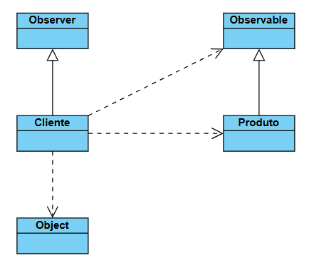

# Exemplo do Padrão de Projeto Observer
Este projeto demonstra uma implementação do padrão de projeto comportamental Observer (Observador) usando java.util.Observable e java.util.Observer.

## Cenário
O exemplo simula um cenário de e-commerce:

- **Produto (Subject):** É o objeto "Observável". Seu estado principal monitorado é se está emEstoque.

- **Cliente (Observer):** É o objeto "Observador". Clientes podem se registrar para "observar" um produto que está fora de estoque.

Quando o Produto volta ao estoque, ele notifica automaticamente todos os Clientes registrados.

## Estrutura das Classes
### ```Produto``` (O Subject / Observável)
Esta classe estende java.util.Observable.

- ```Produto(String nome, double preco)```: Construtor. O produto começa com emEstoque = false.

- ```setEmEstoque(boolean novoStatus)```: Este método controla a mudança de estado. Se o produto entra em estoque (false -> true), ele chama setChanged() e notifyObservers() para alertar os clientes.

- ```addObserver()```: Método herdado usado para registrar clientes.

### ```Cliente``` (O Observer / Observador)
Esta classe implementa java.util.Observer.

- ```registrarInteresse(Produto produto)```: Método de conveniência que chama produto.addObserver(this), inscrevendo o cliente nas notificações daquele produto.

- ```update(Observable produtoObservado, Object arg1)```: Método "callback" chamado pelo Produto durante a notificação. Ele atualiza a ultimaNotificacao do cliente informando que o produto está disponível.

## Diagrama de classes

